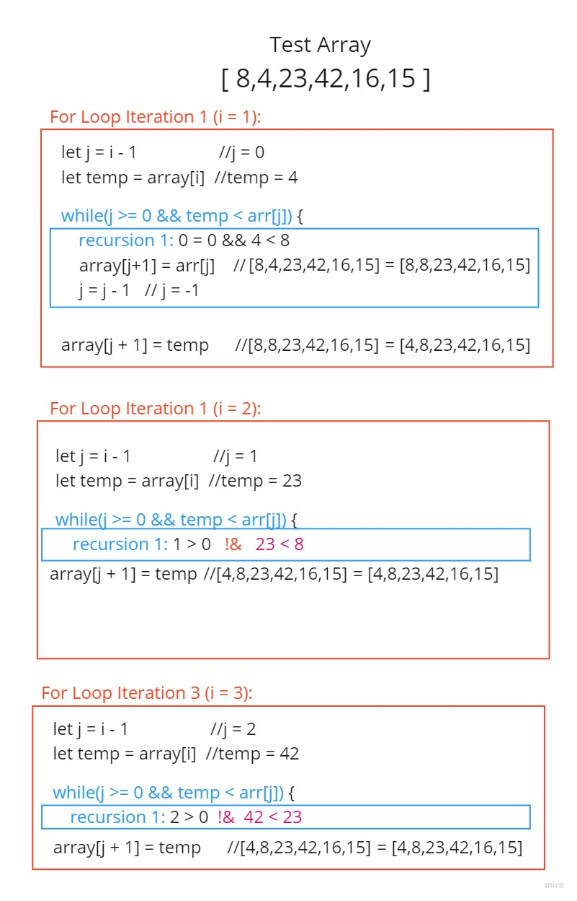
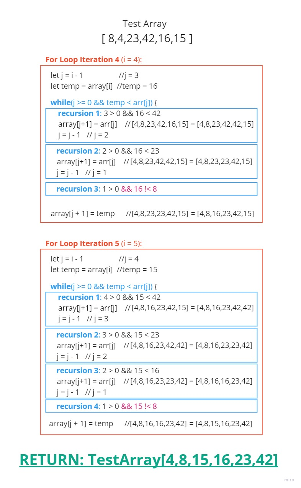

# Codefellows 401JS

## - Code Challenge 26

### Review the pseudocode below, then trace the algorithm by stepping through the process with the provided sample array

### Document your explanation by creating a blog article that shows the step-by-step output after each iteration through some sort of visual  

### Once you are done with your article, code a working, tested implementation of Insertion Sort based on the pseudocode provided

## InsertionSort()

### Overview

1) This function takes in an array of integers as a parameter.

2) Sorts the array from lowest to highest value via a for loop, a conatiner variable, two integer variables, and a while loop.

3) The newly sorted array is then returned.

### Algorithm

+ An array is passed as a parameter ( `[8,4,23,42,16,15]` )
+ Inside of a for loop where `i = 1`, iterating the length of the array `(i < array.length`):
 + Create a `let j = i – 1` //this will create an integer which represents the previous item in the array.
 + Create a `let temp = array[i]` //this assigns the current array index item being evaluated inside a temporary variable

 + Inside of a while loop(`j >= 0 && temp < arr[j]`):
  + Each recursion of the while loop will occur only while 
  + 1) `j` has not gone out of the index of the array (below 0) AND
  + 2) `temp` evaluates as less than the previous index item of the array (since `j = i-1`)
   + Since the current array index item ( `temp` ) is evaluated as being less than the previous array index item ( `array[j}` ), the current index’s array item is reassigned with the previous index’s item:
    `( array[j+1] = arr[j] )`
   + We decrement `j` by 1: 
   `( j = j – 1 )`  //this will cause `j` to eventually reach -1, where we will break out of the while loop since we will be out of the index of the array.
   + The `temp` value is placed at one array index higher than `j`:

+ `( array[j + 1] = temp )`   //This will ensure that however many places the while loop evaluated the array by decrementing `j`, the `temp` value will be placed earlier in the array up until that point.
   + // or if the while loop was never entered the value will be stored in the same index as if nothing changed. This process will continue with each index of the array.

### Solution

